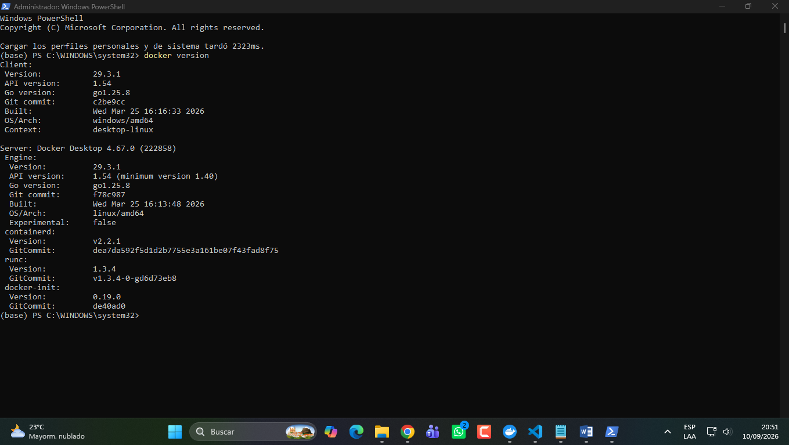
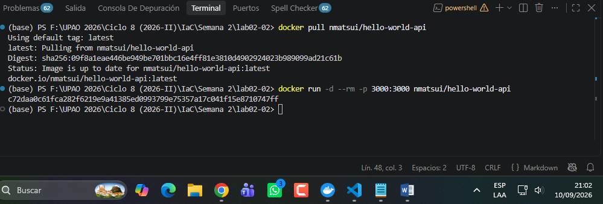
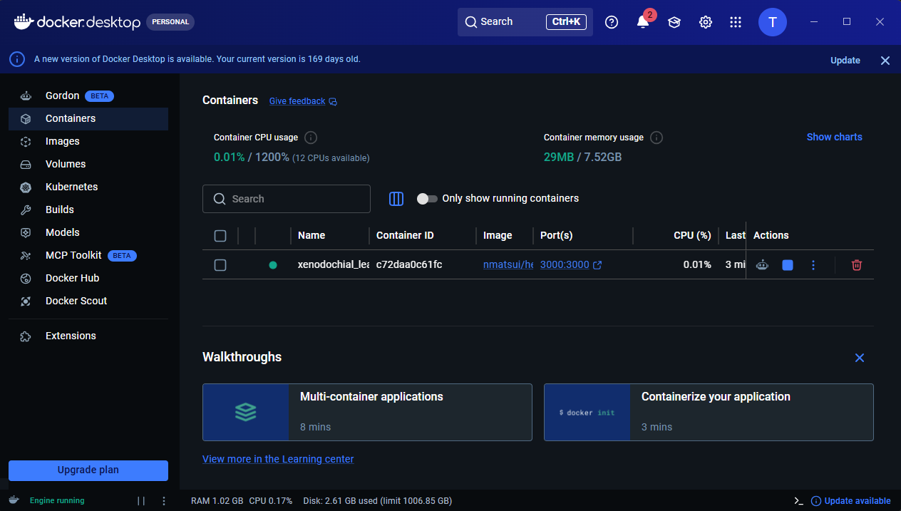
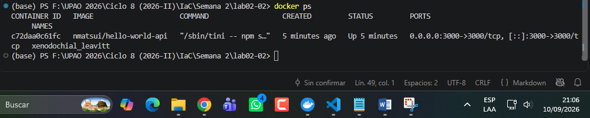
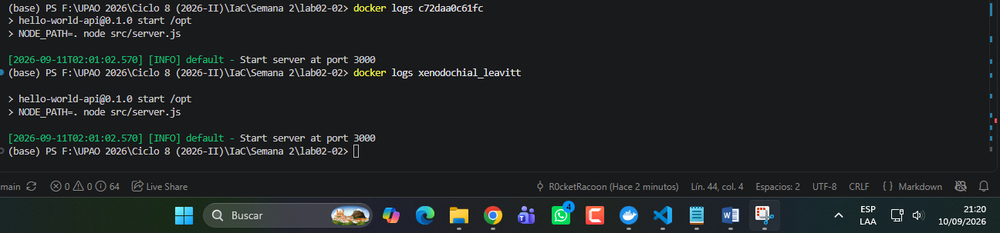
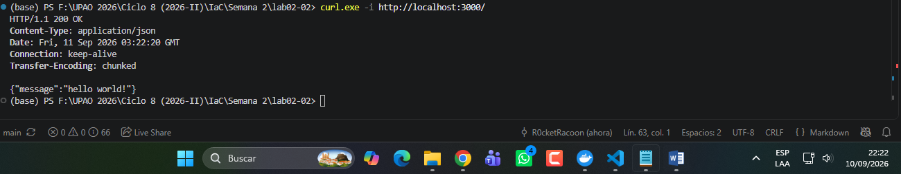
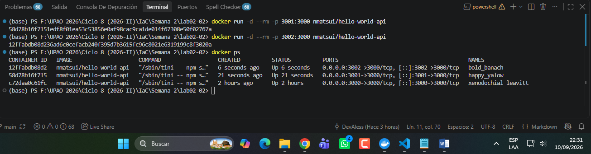
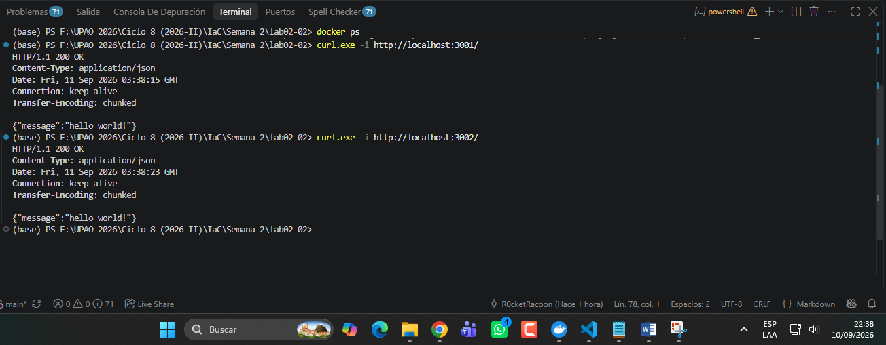
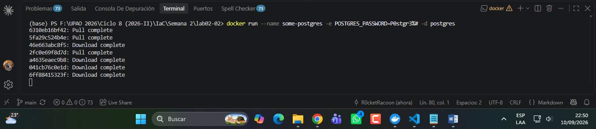
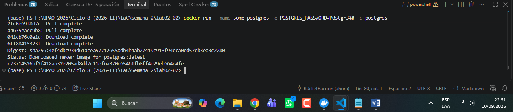

# Laboratorio 02

Hoy utilizaremos docker compose para poder desplegar su trabajo. Servicio web y una base de datos

## Stack
API
  - Minimal API
    - Debe retornar un mensaje incluyendo mi nombre
  - Docker
- docker run -d --rm -p 3000:3000 nmatsui/hello-world-api.  8c446d43dfc9 focused_wilson
docker run -d --rm -p 3001:3000 nmatsui/hello-world-api  sweet_sammet

BD
  - PostgreSQL
- $ docker run --name some-postgres -e POSTGRES_PASSWORD=mysecretpassword -d postgres


# Indicaciones

Trabajar un docker compose, especificando configuración y comandos para despliegue. Debe permitir lo siguiente:
- 3 copias de una API build local
- Configuración BD
- Uso de volúmenes
- Uso de variables de entorno
- En README. Responder los tipos de redes y los tipos de volumen que existen en docker
- Hacer uso de Conventional Commits
- Repositorio publico
- Uso de .gitignore
- Opcional: Capturas de su proyecto desplegado en README.md
Deben subir la actividad en un repositorio publico de GitHub
Uso de IA no está permitido, en caso de evidenciar uso de IA la calificación es de 0.

## Comandos

```bash
docker version
```


```bash
docker pull nmatsui/hello-world-api
```

```bash
docker run -d --rm -p 3000:3000 nmatsui/hello-world-api
```





```bash
docker ps
```



```bash
docker logs ID/Nombre
```



```bash
curl.exe -i http://localhost:3000/
```




```bash
docker run -d --rm -p 3001:3000 nmatsui/hello-world-api

docker run -d --rm -p 3002:3000 nmatsui/hello-world-api
```






```bash
docker run --name some-postgres -e POSTGRES_PASSWORD=mysecretpassword -d postgres
```






```bash
docker compose up -d
```

## Configuración por entorno

```
MESSAGE=<Colocar nombre>
```


# Creditos
- Fabricio Alessandro Colona Chávez **(ID: 000244576)**

# ETC
